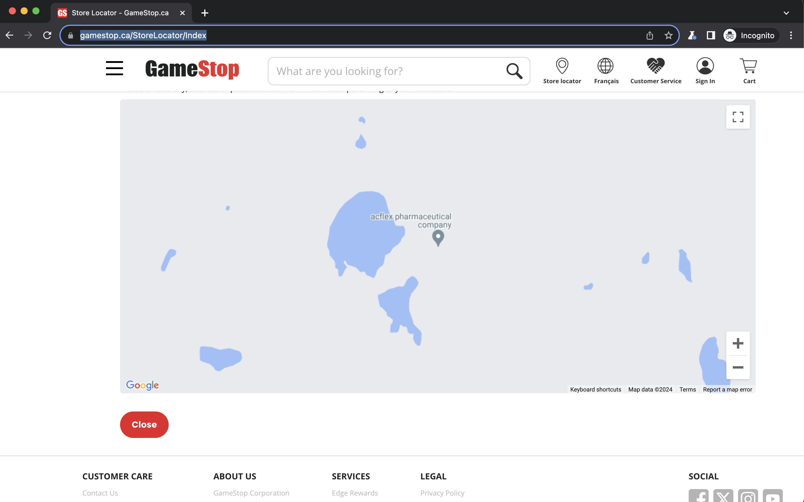

Input:

```
Find the store location and hours of the closest Gamestop to zip code 90028 and set as home store
```

Output:

```
I have entered the zip code 90028 and clicked the search button. The map has loaded, but I need to find the specific store location and hours. I will look for any clickable elements on the map that might provide more details about the store.

action:
scroll(0, 500)
click('881')
```


